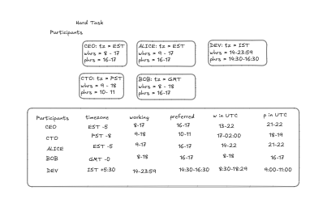
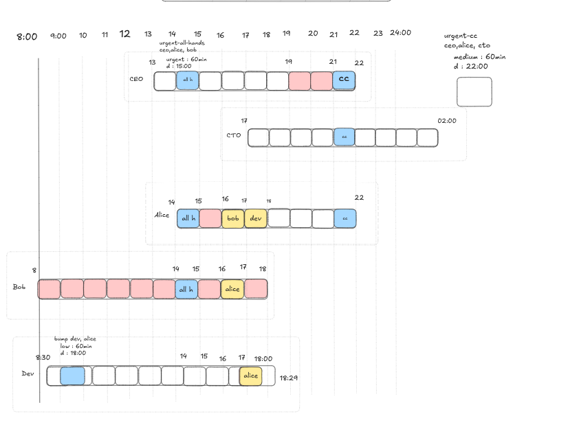

# Meeting Negotiator V1 Environment

A multi-step RL environment for calendar coordination with time zones, priorities, preferences, deadlines, and cascading conflicts. The agent must propose slots, adjust, negotiate, and finalize a valid calendar while maximizing satisfaction and minimizing conflicts.

## Project Layout

- `server/meeting_negotiator_v1_environment.py` Environment implementation, scenarios, rewards, and scoring
- `models.py` Action, observation, state, and data models
- `client.py` Thin OpenEnv client wrapper
- `inference.py` LLM inference script with grader-compatible logging
- `openenv.yaml` OpenEnv metadata for deployment
- `server/app.py` FastAPI app entrypoint for HTTP/WS

## Scenarios (Tasks)

The environment supports scenario selection by name in `reset(scenario_id=...)`. If no scenario is provided, it cycles deterministically: EASY → MEDIUM → HARD.

### 1. EASY: The Empty Slate
* **Max Score: 0.99**
* **Description:** A simple 1:1 meeting with basic working hour constraints. An introductory task to verify the agent can correctly parse UTC boundaries.

### 2. MEDIUM: The Greedy Preference Trap
* **Max Score: 0.90**
* **Description:** Multi-timezone coordination optimizing for soft preferences. 
* **The Catch:** The agent must schedule two meetings into two valid slots. Greedily taking the first available slot incurs a `-0.15` penalty. Planning ahead and reversing the order yields the optimal `-0.10` penalty (Score: 0.90). A perfect 1.00 is mathematically impossible.

### 3. HARD: The Zero-Sum Domino Cascade

* **Max Score: 0.80**
* **Description**: A 5-step priority cascade requiring reverse-chronological spatial reasoning, fractional timezone math (IST), and soft-constraint optimization across four timezones.
* **The Catch**: The model must untangle an unbumpable gridlock using manual rescheduling to clear a strict-deadline funnel, while actively tracking dynamically bumped meetings and a 24-hour synthetic deadline "wall." Furthermore, a chronological "Trolley Problem" decoy trap will silently penalize greedy models that grab the first available slot (Max Score: 0.80).

## **Possible Optimal Solution**





## Step 1: Move Alice+Dev: EVT-ALICE-DEV-URGENT with Dev to 17:00 UTC
Due to rescheduling of EVT-ALICE-DEV-URGENT, Dev's low priority event(EVT-DEV-LOW) is automatically bumped and enters into pending requests

## Step 2: Now the 16:00 block is free for Alice's & Bob's Meeting, Move Alice+Bob Meeting: EVT-ALICE-BOB-URGENT with Bob to 16:00 UTC

## Step 3: Now moving EVT-ALICE-DEV-URGENT to 17:00 and moving EVT-ALICE-BOB-URGENT to 16:00 creates a free slot for REQ-URGENT-ALL-HANDS at 14:00, Schedule REQ-URGENT-ALL-HANDS at 14:00 UTC
### (Note: This a -0.15 unavoidable preference penalty since it is outside all three attendees' preferred hours, which is expected by design) 

## Step 4: Dev's bumped meeting must be rescheduled before its 18:00Z deadline. Dev is wide open in the morning
Schedule REQ-BUMPED-DEV to 9:00 UTC

## Step 5: Schedule REQ-CTO-SYNC at 21:00 UTC, this satisfies Alice and CEO but not CTO (unavoidable thus a preference penalty of -0.05)

## TOTAL PREFERENC PENALTY = -0.15 + (-0.05) => -0.20
## FINAL SCORE = 1 - 0.20 = 0.80

All dates are set to **January 15, 2026** to avoid DST ambiguity.

## Quick Start

```python
from meeting_negotiator_v1 import MeetingNegotiatorV1Action, MeetingNegotiatorV1Env

with MeetingNegotiatorV1Env(base_url="http://localhost:8000") as env:
    result = env.reset(scenario_id="HARD")
    obs = result.observation
    print(obs.last_action_feedback)

    # Example: Check availability, then schedule, then submit
    req_id = obs.pending_requests[0].request_id
    env.step(MeetingNegotiatorV1Action(
        command="CheckAvailability",
        target_id=req_id,
        proposed_start_utc="2026-04-01T15:00Z",
    ))

    env.step(MeetingNegotiatorV1Action(
        command="ScheduleNew",
        target_id=req_id,
        proposed_start_utc="2026-04-01T15:00Z",
    ))

    final = env.step(MeetingNegotiatorV1Action(command="SubmitFinalCalendar"))
    print("Score:", final.observation.score)
```

## Action Space

`MeetingNegotiatorV1Action`
- `command`: `CheckAvailability`, `ScheduleNew`, `RescheduleExisting`, `SubmitFinalCalendar`
- `target_id`: request_id for `ScheduleNew`, event_id for `RescheduleExisting`
- `proposed_start_utc`: required for `CheckAvailability`, `ScheduleNew`, `RescheduleExisting`

## Observation Space

`MeetingNegotiatorV1Observation`
- `current_time_utc`, `participants`, `calendar_state`, `pending_requests`
- `last_action_feedback`, `turn_count`, `max_turns`
- `score` (0.0-1.0), `reward`, `done`

## Rewards and Scoring

The environment provides **dense, penalty-based rewards** plus a final score.

Step penalties and bonuses (see `server/meeting_negotiator_v1_environment.py`):
- Step cost each action
- Penalties for invalid actions and conflicts
- Small penalties for preference violations
- Bonuses for successful scheduling, priority, and early deadline satisfaction

Final score (constraint-based, deterministic):
- Penalizes unscheduled requests, deadline misses, outside working hours, conflicts, and preference violations
- `score ∈ [0.0, 1.0]` on `SubmitFinalCalendar`
- Maximum possible score: `1.0`

## Running Locally

Start the server:

```bash
uvicorn server.app:app --host 0.0.0.0 --port 8000
```

Then run the inference script:

```bash
python inference.py
```

Required environment variables for `inference.py`:
- `API_BASE_URL`
- `MODEL_NAME`
- `HF_TOKEN` (or `API_KEY`)

## Deployment

Build the Docker image:

```bash
docker build -t meeting_negotiator_v1-env:latest -f server/Dockerfile .
```

Push to Hugging Face using OpenEnv:

```bash
openenv push
```

## Notes

- The environment supports multiple concurrent WebSocket sessions.
- Unknown timezones raise a validation error and cause the slot to be rejected.
- The preference signal is surfaced in `last_action_feedback` to aid learning.
